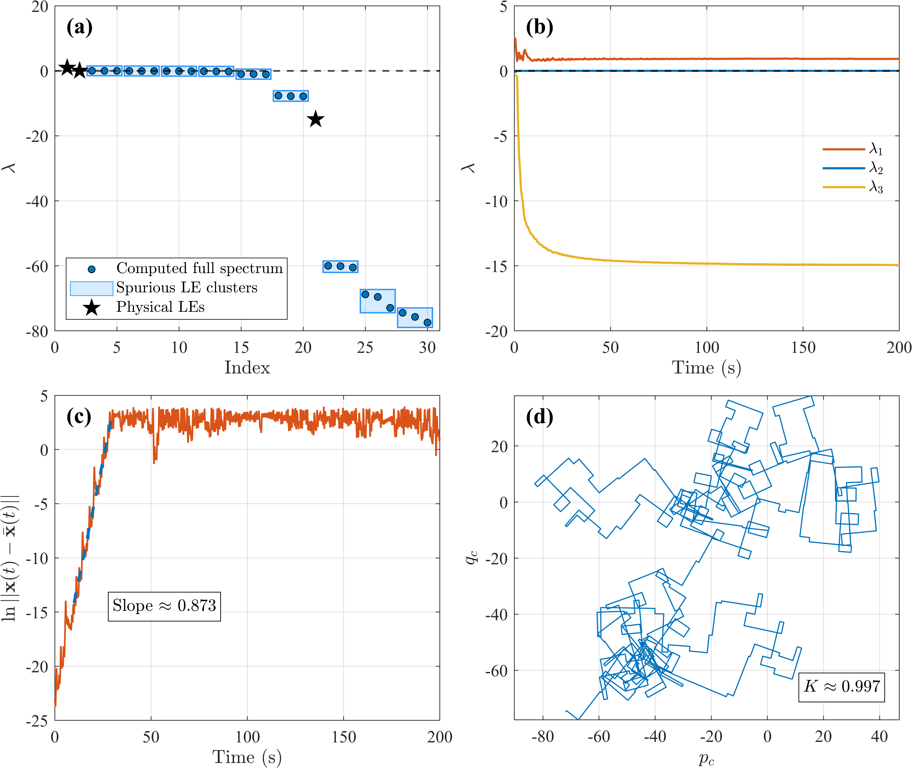

# FO_LEs_ISR
This is the official code release for the paper: **Unveiling and resolving algorithmic false chaos in fractional-order systems via infinite state representation**
## Overview
Classical discrete algorithms for computing Lyapunov Exponents (LEs) frequently generate "false chaos" artifacts when applied to non-local fractional-order systems (FOS) due to time-domain memory truncation or history pollution. 

This repository implements the **Infinite State Representation (ISR) framework**, which resolves this conflict by mapping the fractional operator into a continuous spectrum of integer-order ODEs. This allows the application of discrete reorthonormalization without breaking physical memory continuity.

## Results Showcase

The following figure demonstrates the successful extraction of physical LEs for the fractional Lorenz system ($\alpha=0.995$) using our ISR framework:



*(a) Isolation of physical LEs from augmented spurious clusters via Degeneracy-Rejection. (b) Convergence history. (c) Two-trajectory experimental validation. (d) 0-1 test for chaos.*

## Features

- **ISR Kernel Approximations:** Supports both frequency-domain Oustaloup recursive approximation and time-domain nonlinear least-squares optimization.
- **Augmented LE Spectrum Computation:** Discrete QR decomposition to evaluate the augmented Lyapunov spectrum.
- **Degeneracy-Rejection Algorithm:**  Extracts intrinsic physical LEs from the augmented spurious clusters.
- **Cross-Validation Tools:** Includes the Two-Trajectory Experimental LLE tracking and the 0-1 Test for chaos.

## Quick Start

1. Clone the repository:

   ```bash
   git clone https://github.com/YourName/Fractional-ISR-LEs.git
   ```

2. Open MATLAB and navigate to the project root directory.

3. Run the main script to reproduce the fractional Lorenz system analysis:

   ``` matlab
   main
   ```

*Note: Fractional integration can be time-consuming. We have included pre-computed data in the /Data folder. You can directly run plot_Lorenz_ISR_results.m to instantly visualize the results without re-running the full simulation.*
